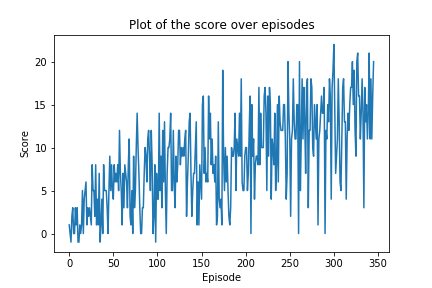

# Report
---

## Algorithm

In this implementation we used the Deep Q-Networks vanilla algorithms contained in [`agent.py`](agent.py).

First we set the maximum number of training episodes, the maximum number of timesteps per episode `max_t`, the starting value of epsilon, for epsilon-greedy action selection, here `eps_start = 0.5` and then each episode we change it by `eps = eps/ i_episode` so that way at the begining the agent has the possibility of selecting a greedy action, but might select a non-greedy action instead and at the end he always selects the greedy action.
Since, the environment is considered eposidic, each episode continues until `max_t` time-steps is reached or until the episode has ended (`done = True`).</br>
A reward of `+1` is provided for collecting a yellow banana, and a reward of `-1` is provided for collecting a blue banana. 


### DQN Agent Hyper Parameters

- BUFFER_SIZE (int): replay buffer size
- BATCH_SIZ (int): mini batch size
- GAMMA (float): discount factor
- TAU (float): for soft update of target parameters
- LR (float): learning rate for optimizer
- UPDATE_EVERY (int): how often to update the network

Where 
`BUFFER_SIZE = int(1e5)`, `BATCH_SIZE = 64`, `GAMMA = 0.99`, `TAU = 1e-3`, `LR = 0.0005` and `UPDATE_EVERY = 4`  


### Neural Network
A state is fed as input to the [model](model.py) which has an initial dimension same as the state size. It contains 2 Fully Connected Layers with `64`, `128` respectively with Relu activation each and followed by a final Fully Connected layer with the same number of units as the action size. 

## Performance plot



```
Episode 100     Average Score: 4.49 
Episode 200     Average Score: 8.02 
Episode 300     Average Score: 11.58
Episode 346     Average Score: 13.02
Environment solved in 346 episodes!     Average Score: 13.02

```

## Improvements

A lots of improvements can be applied to the current implementation such searching more in the Hyperparameter space for the adequate hparams. Also adding Prioritized Experience Replay in order to prioritize experiences so we can focus on those that have difference between the estimated Q value and the actual Q value and learn from them. 
We can add also Double Deep Q Networks and/or Dueling Deep Q Networks and try to learn from raw pixels.


